<div align="center">
  
</div>

<h1 align="center">KasperZF</h1>
<h3 align="center">Concepteur &amp; développeur d'applications depuis 2022</h3>

<p align="center">
  Je conçois des applications utiles, propres et rapides pour transformer une idée en produit concret :
  interfaces, automatisations, outils métier, sites et expériences web.
</p>

<p align="center">
  <a href="https://github.com/KasperZF?tab=repositories">
    
  </a>
  
  
</p>

<p align="center">
  <code>#Windows</code>
  <code>#Linux</code>
  <code>#Desktop</code>
  <code>#Web</code>
  <code>#UI</code>
  <code>#Automation</code>
  <code>#OpenSource</code>
</p>



### `> whoami`

```txt
KasperZF
role      : Concepteur & developpeur d'applications
since     : 2022
mindset   : concevoir clair, coder propre, livrer concret
systems   : Windows + Linux
```

Je travaille avec une logique produit : comprendre le besoin, dessiner une interface qui se tient,
coder une base fiable, puis itérer jusqu'à obtenir quelque chose d'agréable à utiliser.

### `> stack`

<p align="center">
  
  
  
  
  
  
  
  
  
  
  
  
</p>

### `> ce que je construis`

| Zone | Ce que j'aime livrer |
| --- | --- |
| Applications | Outils desktop et web, interfaces métier, tableaux de bord, workflows simples. |
| Expérience | Parcours lisibles, micro-interactions utiles, UI propre et efficace. |
| Automatisation | Scripts, pipelines, intégrations API, génération de fichiers et actions répétitives. |
| Environnements | Développement et déploiement sur Windows, Linux, GitHub et services cloud. |

### `> signaux GitHub`

<p align="center">
  
  
</p>

### `> contribution snake`

<p align="center">
  <picture>
    <source media="(prefers-color-scheme: dark)" srcset="https://raw.githubusercontent.com/KasperZF/KasperZF/output/snake-dark.svg" />
    <source media="(prefers-color-scheme: light)" srcset="https://raw.githubusercontent.com/KasperZF/KasperZF/output/snake.svg" />
    
  </picture>
</p>

<p align="center">
  <sub>Le snake est généré automatiquement par GitHub Actions et se balade dans la grille de contributions.</sub>
</p>


<p align="center">
  <code>build</code> <code>design</code> <code>ship</code> <code>repeat</code>
</p>
