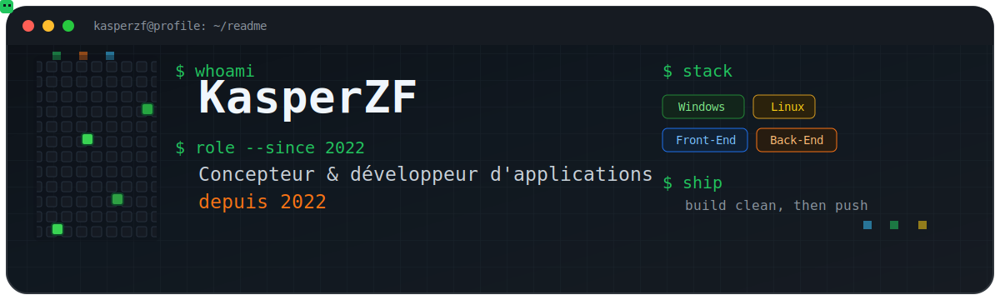

  

<h1 align="center">KasperZF</h1>

  Diplômé en conception et développement d'applications, je conçois et développe depuis 2022
  avec l'objectif de transformer une idée en outil clair, utile et agréable à utiliser. 
  Et si l'application évite de transformer le PC en radiateur, c'est encore mieux.

  
  

<!-- profile-date:start -->

Dernière mise à jour : 9 mai 2026

<!-- profile-date:end -->

### `> stack`

  
  
  
  
  
  
  
  
  
  
  
  
  
  
  
  
  

